# DevContainer - VirtueMart Webpay REST Plugin

Este devcontainer proporciona un entorno completo de desarrollo para el plugin Webpay REST de VirtueMart 3.x.

## 🚀 Inicio rápido

1. Abre el proyecto en VS Code
2. Cuando se te pregunte, selecciona "Reopen in Container"
3. Espera a que se construya el contenedor (puede tomar unos minutos la primera vez)
4. Una vez listo, VirtueMart estará disponible en http://localhost:8081/

## 📋 Servicios incluidos

- **Joomla 3.8 + VirtueMart 3.2** con PHP 7.3 (Joomla 3.8.x no soporta oficialmente PHP 7.4+, por eso no se usa una versión más nueva). El contenido de Joomla/VirtueMart se toma del instalador offline que traía la imagen [opentools/docker-virtuemart:j3vm3](https://hub.docker.com/r/opentools/docker-virtuemart/) (abandonada, basada en Debian 9 sin soporte), pero corriendo sobre `php:7.3-apache`, una base mantenida.
- **Apache** para servir el contenido.
- **MySQL 8.4** (LTS) como base de datos.
- **Node 22.x** (con pnpm vía corepack).
- **Extensiones de VS Code** para trabajar con PHP.
- **Composer** para gestión de dependencias PHP.

## 🔗 URLs de acceso

| Servicio      | Acceso                             | Credenciales      |
| ------------- | ----------------------------------- | ----------------- |
| VirtueMart    | http://localhost:8081/              | -                  |
| Admin Panel   | http://localhost:8081/administrator | admin / password   |

## 🛠️ Configuración inicial de VirtueMart

**NOTA:** La primera vez que se levanta el contenedor demorará en instalar todo, esperar al menos unos 5 minutos.

La primera vez es necesario instalar VirtueMart y datos de prueba desde el sitio administrador, ir a http://localhost:8081/administrator e instalar VirtueMart con datos de prueba.

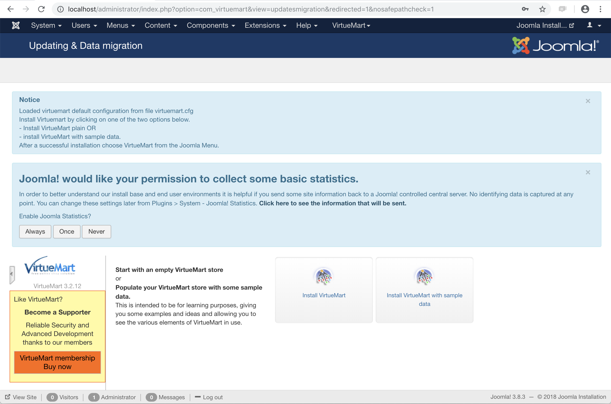

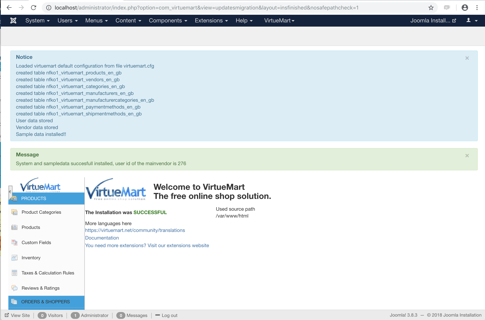

Debes habilitar el registro de usuarios clickeando "Manage" bajo el menú "Users" y una vez que has ingresado presionar el botón [Options].

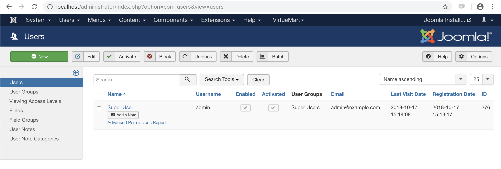

- Allow User registration: **Yes**

Luego presionar el botón [Save] para guardar los cambios.

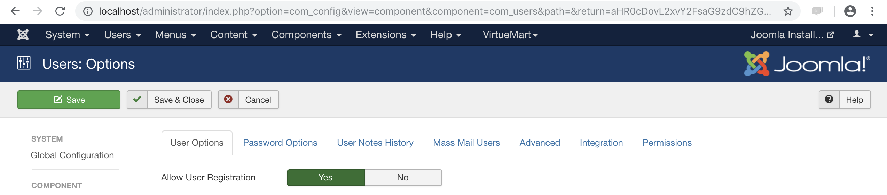

### Configurar moneda Chilena

Ir a (VirtueMart / Shop) y en sección "Currency" elegir "Chilean Peso", luego presionar el botón [Save] para guardar los cambios.

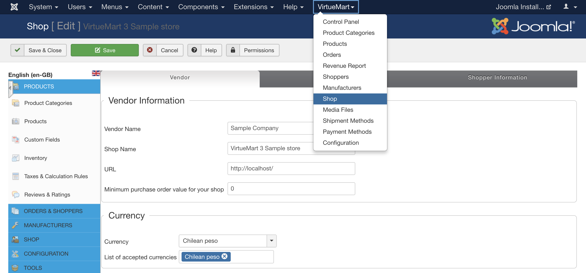

Ir al menu izquierdo (Configuration / Currencies) y seleccionar "Chilean peso"

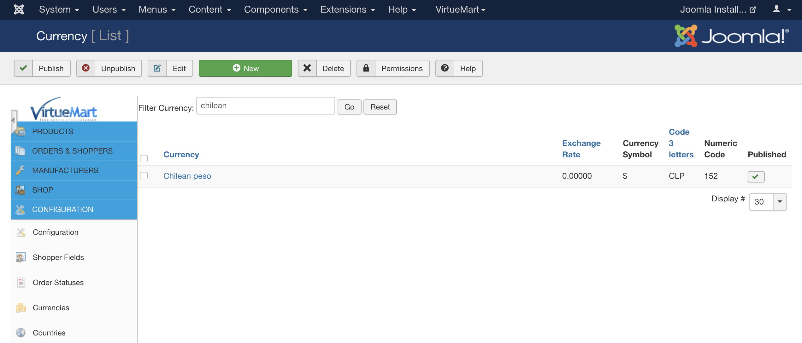

Dejar los valores como se muestran en la siguiente imagen.

- Decimals: 0

Luego presionar el botón [Save] para guardar los cambios.

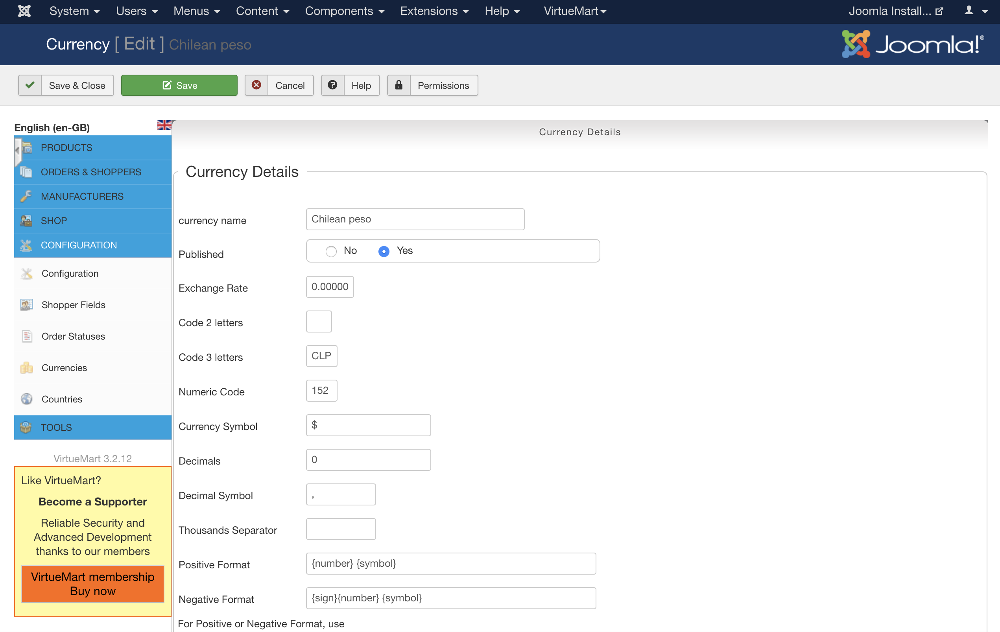

### Habilitar y activar usuario registrado para pruebas

Si registras un usuario de prueba para el comercio, luego de registrarlo deberás habilitarlo y activarlo en la sección de usuarios.

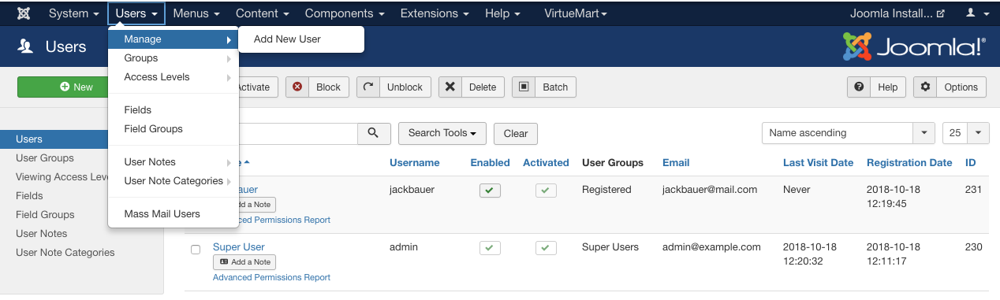

Enabled: Checked
Activated: Checked

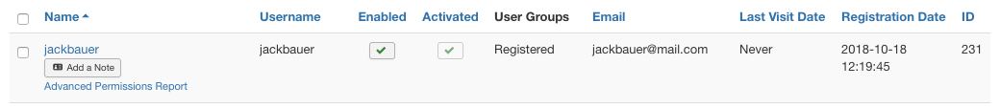

### Configurar error de permisos

Si en algún momento en cualquier pantalla de Joomla aparece el siguiente error, seguir mediante "setup wizard" para corregir.

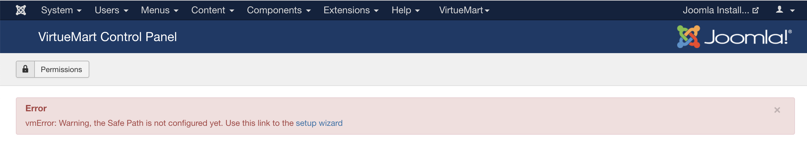

Presionar el botón con el texto "Create and configure safepath using the administrator com_virtuemart folder"

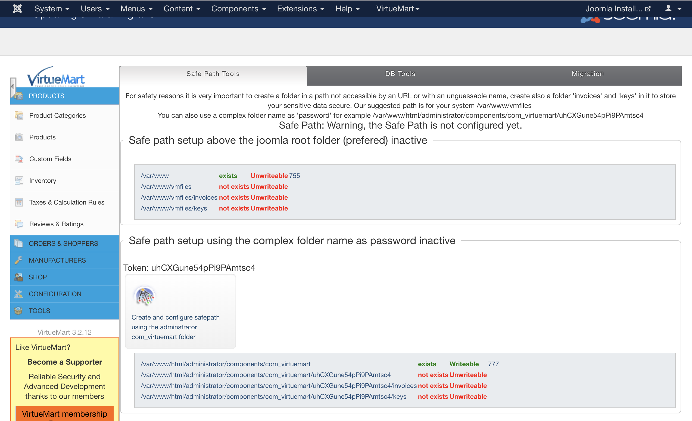

Aceptar el diálogo presionando "Ok"

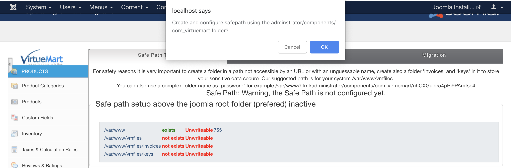

Mostrará que ha sido ejecutado correctamente.

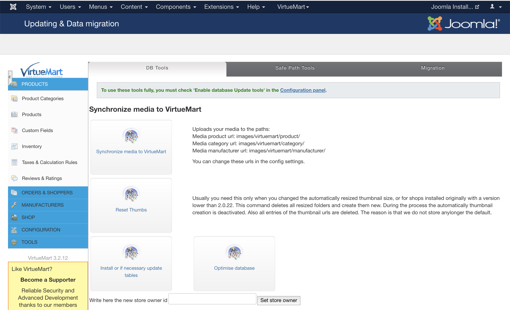

## 🔧 Desarrollo y empaquetado del módulo

VirtueMart no soporta montar ni enlazar el plugin directamente desde el código fuente: se prueba empaquetándolo como `.zip` e instalándolo desde el panel de administración.

1. Los cambios en el plugin **no se reflejan automáticamente** en la tienda — hay que volver a empaquetar e instalar el `.zip` (ver sección siguiente).
2. El archivo de logs del plugin se monta en `.devcontainer/logs/webpay-log.log.php`.
3. Se ha incluido la carpeta `vendor` del plugin en Intelephense para tener las referencias de código del SDK de Transbank.

### Empaquetar e instalar el plugin

Desde el contenedor `web`:

```bash
./config.sh   # instala las dependencias del SDK de Transbank (composer)
./package.sh  # genera plugin-transbank-webpay-virtuemart3-rest-<version>.zip
```

Luego, en http://localhost:8081/administrator:

1. **Extensions > Manage > Install**: sube el `.zip` generado.
2. **Components > VirtueMart > Payment Methods**: configura y activa "Transbank Webpay REST".

Ver [docs/INSTALLATION.md](../docs/INSTALLATION.md) para el detalle con capturas.

## 📚 Dependencias

Las dependencias de Composer (SDK de Transbank) se instalan ejecutando `./config.sh`. Para instalar una nueva dependencia manualmente:

```bash
cd src/transbank_webpay_rest
composer require nueva-dependencia
```

## 🗄️ Base de datos

### Configuración por defecto

- Host: `db`
- Puerto: `3306`
- Base de datos: `virtuemart`
- Usuario: `virtuemart`
- Contraseña: `admin`
- Usuario root: `root` / `admin`

## 📝 Notas de desarrollo

1. **Permisos**: El usuario del contenedor `web` es root, por lo que tiene acceso completo. Apache y el proceso de instalación de Joomla necesitan root para arrancar y ajustar permisos, por eso no se define un usuario no privilegiado.
2. **Persistencia**: A diferencia del setup anterior basado en `docker-virtuemart3`, los datos de VirtueMart (`vm_data`) y de la base de datos (`db_data`) **sí persisten** entre reinicios del contenedor gracias a los volúmenes de Docker; solo se reinstala VirtueMart si se borran esos volúmenes.
3. **Refresco de código**: los cambios no se reflejan automáticamente en la tienda — hay que reempaquetar e instalar el `.zip` (ver [Empaquetar e instalar el plugin](#empaquetar-e-instalar-el-plugin)).
4. **Logs del plugin**: revisa `.devcontainer/logs/webpay-log.log.php` desde el host, o dentro del contenedor: `docker compose -f .devcontainer/docker-compose.yml exec web bash`.
5. **Reinstalar desde cero**: `docker compose -f .devcontainer/docker-compose.yml down -v` borra los volúmenes y fuerza una instalación limpia de VirtueMart la próxima vez que se levante.

## Edición del devcontainer

En caso de editar el devcontainer, es importante reconstruir la imagen para que los cambios se reflejen si ya se usó anteriormente.
En algunas ocasiones VS Code detecta los cambios y sugiere reconstruir el contenedor. En caso contrario se debe hacer manualmente.

### Reconstruir el devcontainer

- Desde VS Code: abre la paleta de comandos (Ctrl/Cmd + Shift + P) → ejecuta **Dev Containers: Rebuild Container**.
- Alternativa rápida: haz clic en el icono de la esquina inferior izquierda (Remote) → "Reopen in Container" y acepta la opción de reconstruir si se muestra.
- Nota importante: la reconstrucción vuelve a crear la imagen y el contenedor; cualquier dato no persistente se perderá.

---

Basado en el instalador offline de Joomla + VirtueMart de:

[Imagen docker Virtuemart](https://hub.docker.com/r/opentools/docker-virtuemart/)

[Repository Virtuemart](https://github.com/open-tools/docker-virtuemart)

corriendo sobre la imagen oficial [php:7.3-apache](https://hub.docker.com/_/php), ya que la imagen `opentools/docker-virtuemart` está abandonada desde 2018 y su base (Debian 9) ya no tiene repositorios `apt` accesibles.
