# Manual de instalación para Plugin Virtuemart

## Descripción

Este plugin oficial ha sido creado para que puedas integrar Webpay fácilmente en tu comercio, basado en Virtuemart.

## Requisitos

Debes tener instalado previamente Virtuemart.

Habilitar los siguientes módulos / extensiones para PHP:
- Soap
- OpenSSL 1.0.1 o superior
- SimpleXML
- DOM 2.7.8 o superior

## Instalación de Plugin

1. Dirígete a [https://github.com/TransbankDevelopers/transbank-plugin-virtuemart-webpay/releases/latest](https://github.com/TransbankDevelopers/transbank-plugin-virtuemart-webpay/releases/latest), y descargue la última versión disponible del plugin.

  Una vez descargado el plugin, ingresa a la página de administración de VirtueMart (usualmente en http://misitio.com/administrator, http://localhost/administrator) y dirígete a (Extensions / Manage / Install), indicado a continuación:

  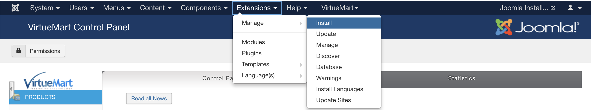
  
2. Arrastra o selecciona el archivo que descargaste en el paso anterior. Al finalizar aparecerá que fue instalado exitosamente.

  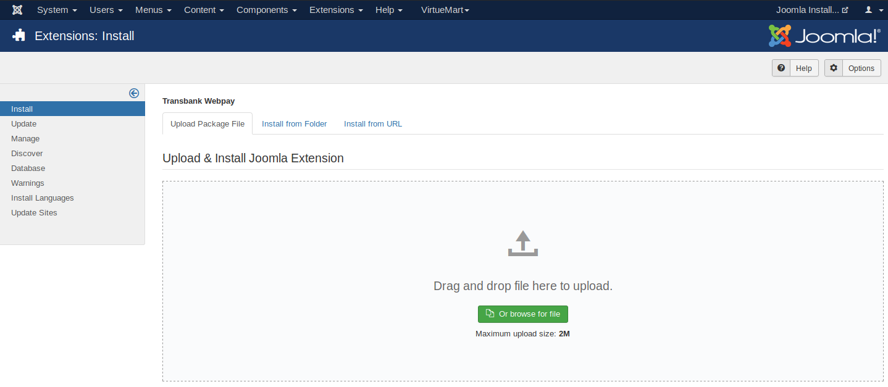

  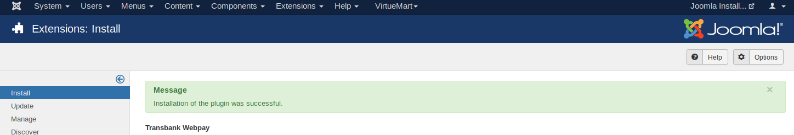

## Configuración

Este plugin posee un sitio de configuración que te permitirá ingresar credenciales que Transbank te otorgará y además podrás generar un documento de diagnóstico en caso que Transbank te lo pida.

**IMPORTANTE:** El plugin solamente funciona con moneda chilena (CLP). Dado esto VirtueMart debe estar configurado con moneda Peso Chileno y país Chile para que se pueda usar Webpay.

Para acceder a la configuración, debes seguir los siguientes pasos:

1. Dirígete a la página de administración de VirtueMart (usualmente en http://misitio.com/administrator, http://localhost/administrator) e ingresa usuario y clave.

2. Dentro del sitio de administración dirígete a (VirtueMart / Payment Methods).

  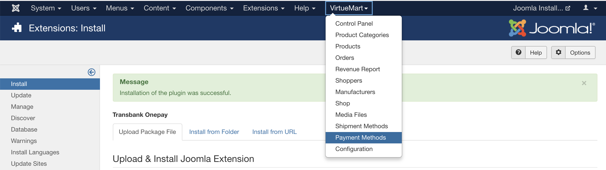

3. Debes crear un nuevo medio de pago presionando el botón [New].

  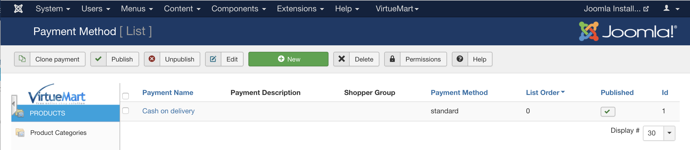

4. Ingresar los datos para "Transbank Webpay" como se muestra en la siguiente imagen.

    - Payment Name: Transbank Webpay 
    - Sef Alias: transbank_webpay
    - Published: Yes
    - Payment Method: Transbank Webpay
    - Currency: Chilean peso

  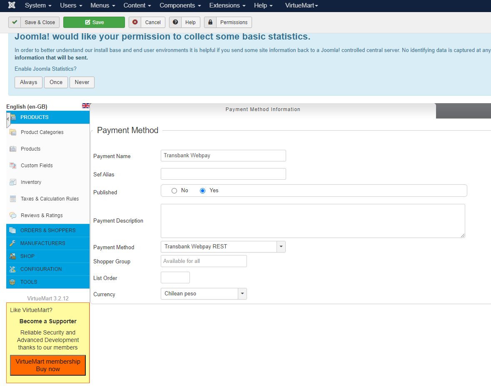

5. Presiona el botón [Save] para guardar el nuevo medio de pago. Se informará que ha sido guardado.

  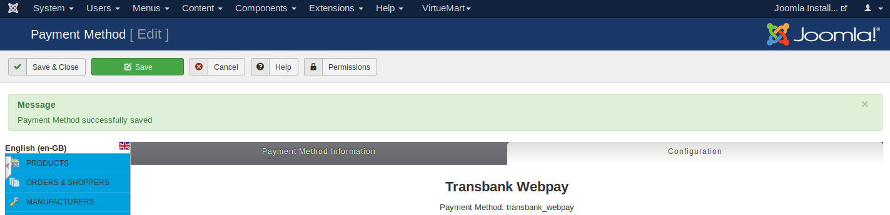

6. Selecciona la sección "Configuration" para configurar el plugin.
   
  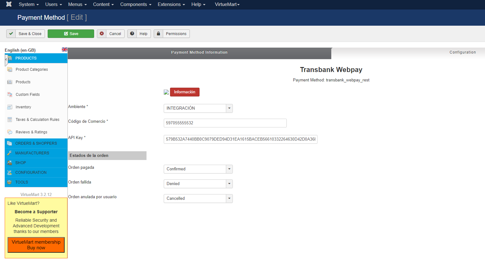

3. ¡Ya está! Estás en la pantalla de configuración del plugin, debes ingresar la siguiente información:

  * **Ambiente**: Ambiente hacia donde se realiza la transacción. 
  * **Código de comercio**: Es lo que te identifica como comercio.
  * **Llave Privada**: Llave secreta que te autoriza y valida a hacer transacciones.
  * **Certificado publico**: Llave publica que te autoriza y valida a hacer transacciones.
  * **Certificado Transbank**: Llave secreta de webpay que te autoriza y valida a hacer transacciones.

  Las opciones disponibles para _Ambiente_ son: "Integración" para realizar pruebas y certificar la instalación con Transbank, y "Producción" para hacer transacciones reales una vez que Transbank ha aprobado el comercio.
  
### Credenciales de Prueba

Para el ambiente de Integración, puedes utilizar las siguientes credenciales para realizar pruebas:

* Código de comercio: `597020000540`
* Llave Privada: Se puede encontrar [aquí - private_key](https://github.com/TransbankDevelopers/transbank-webpay-credenciales/blob/master/integracion/Webpay%20Plus%20-%20CLP/597020000540.key)
* Certificado Publico: Se puede encontrar [aquí - public_cert](https://github.com/TransbankDevelopers/transbank-webpay-credenciales/blob/master/integracion/Webpay%20Plus%20-%20CLP/597020000540.crt)
* Certificado Webpay: Se puede encontrar [aquí - webpay_cert](https://github.com/TransbankDevelopers/transbank-sdk-php/blob/master/lib/webpay/webpay.php#L39)

1. Guardar los cambios presionando el botón [Guardar]

2. Además, puedes generar un documento de diagnóstico en caso que Transbank te lo pida. Para ello, haz click en el botón "Información" ahí podrás descargar un pdf.

  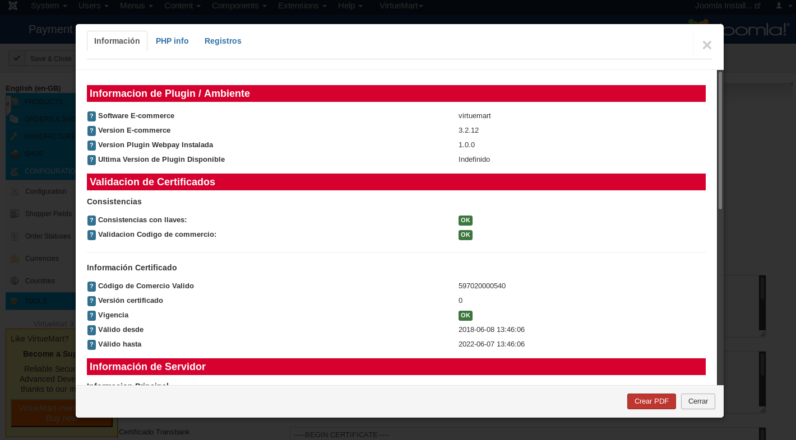

## Prueba de instalación con transacción

En ambiente de integración es posible realizar una prueba de transacción utilizando un emulador de pagos online.

* Ingresa al comercio

  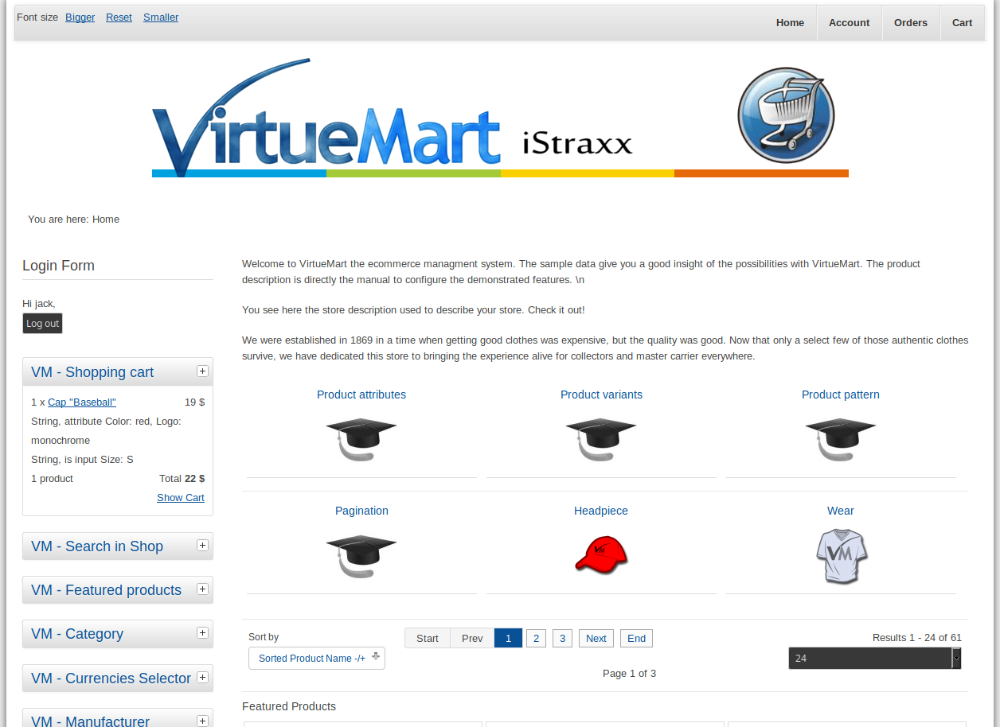

* Ya con la sesión iniciada, ingresa a cualquier sección para agregar productos

  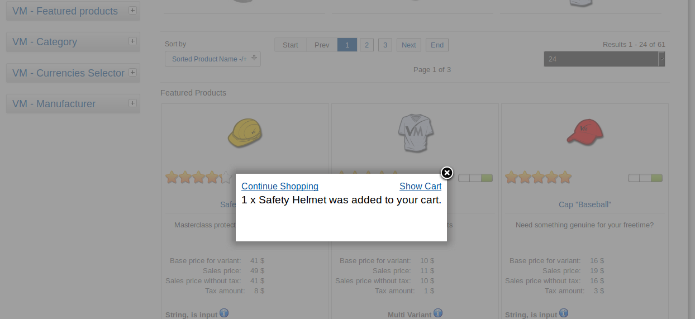

* Agrega al carro de compras un producto, selecciona el carro de compras y selecciona Transbank Webpay, selecciona términos de servicio y luego presiona el botón [Confirm Purchase]:

  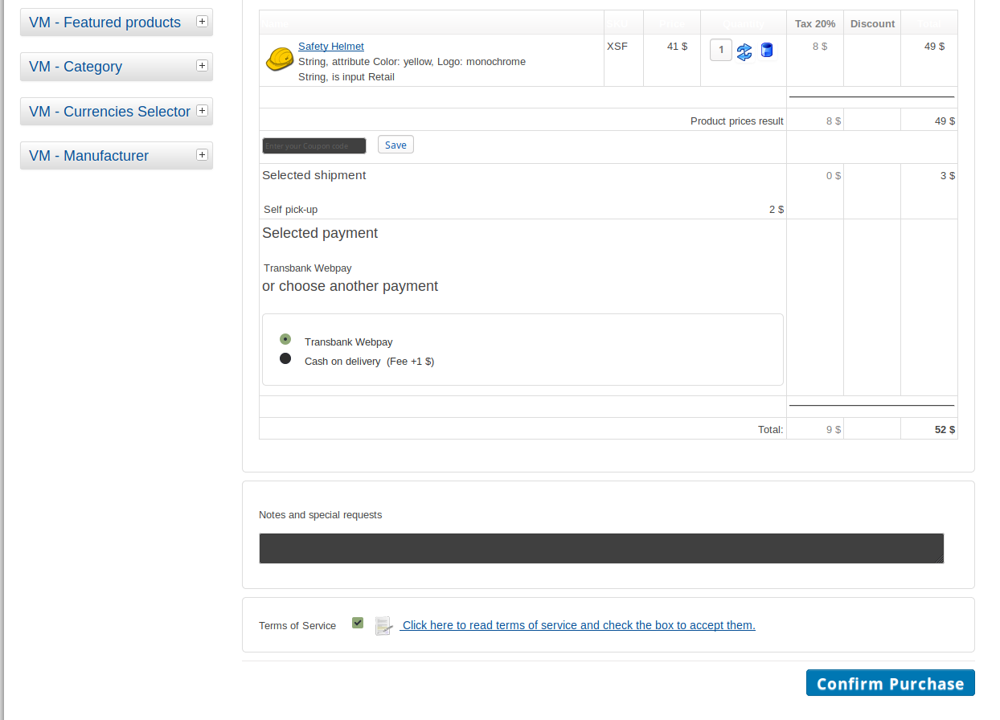

* Una vez presionado el botón para iniciar la compra, se mostrará la ventana de pago Webpay y deberás seguir el proceso de pago.

Para pruebas puedes usar los siguientes datos:  

* Número de tarjeta: `4051885600446623`
* Rut: `11.111.111-1`
* Cvv: `123`
  
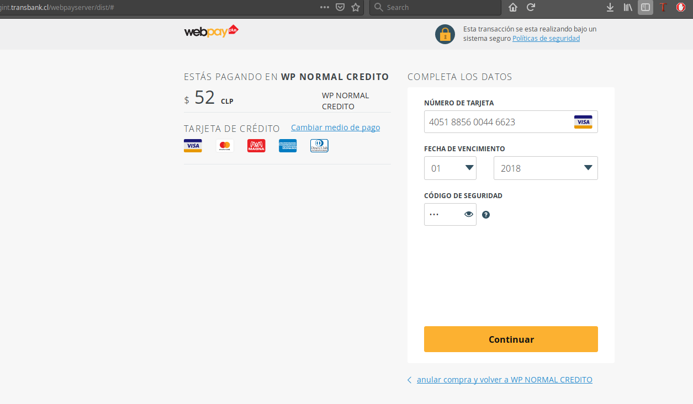

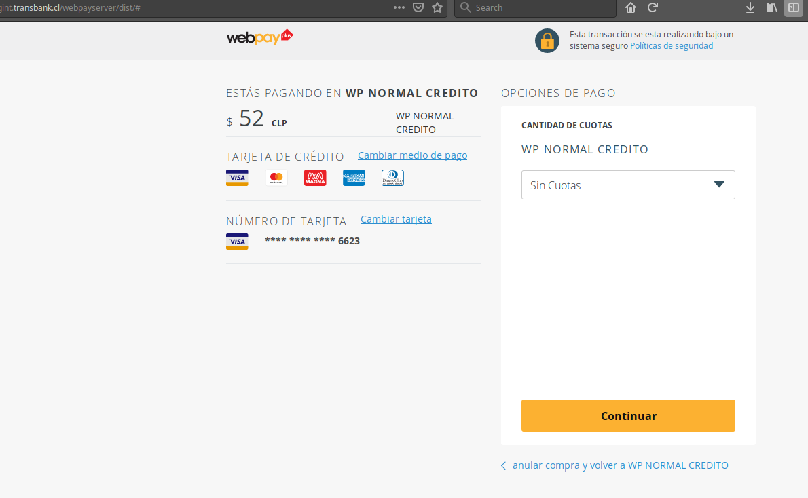

Para pruebas puedes usar los siguientes datos:  

* Rut: `11.111.111-1`
* Clave: `123`

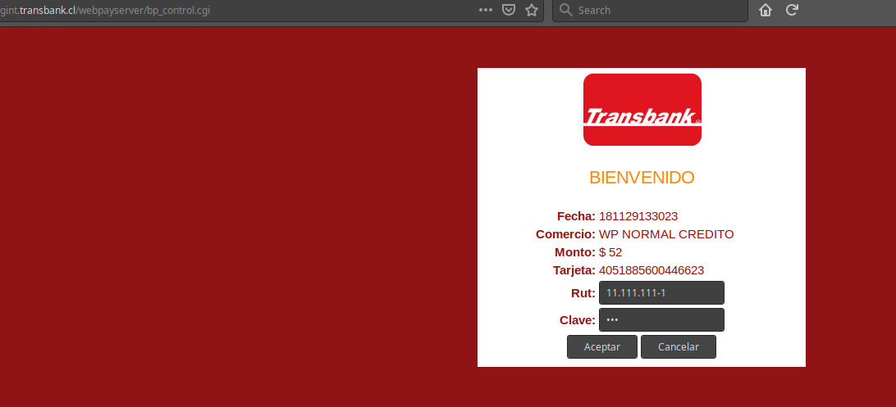

Puedes aceptar o rechazar la transacción

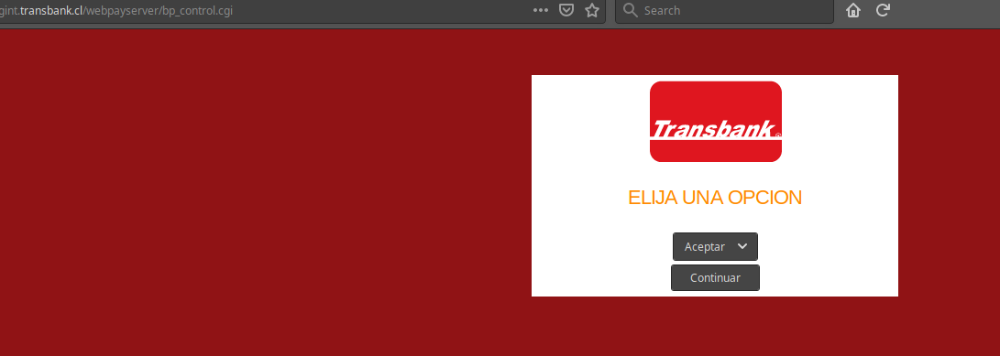

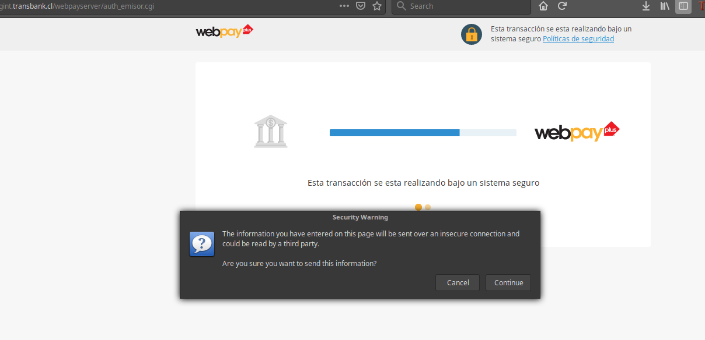

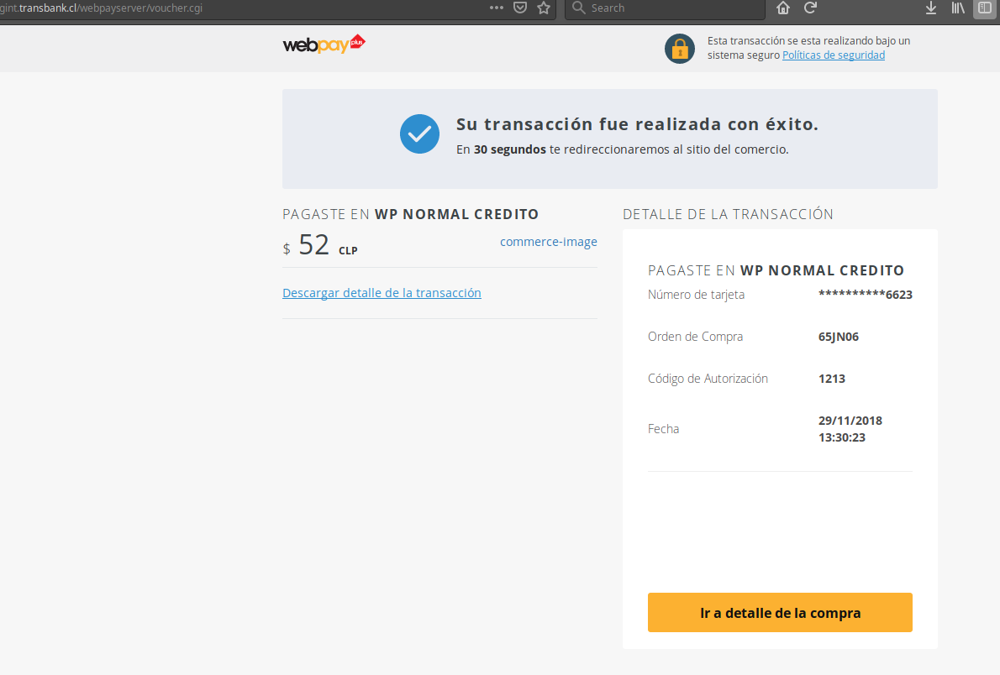
  
* Serás redirigido a Virtuemart y podrás comprobar que el pago ha sido exitoso.

 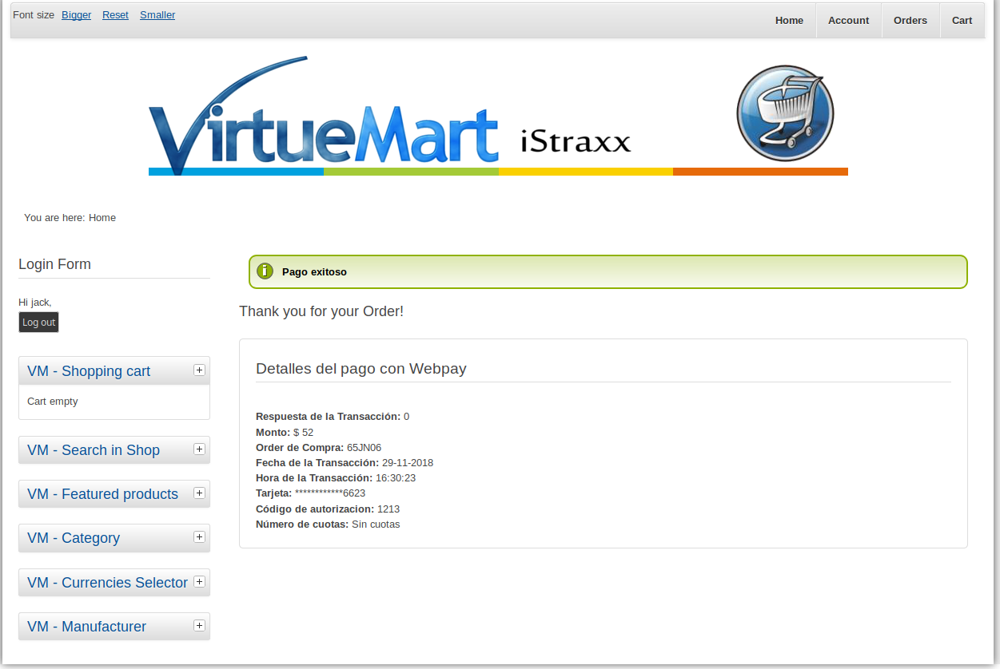

* Además si accedes al sitio de administración sección (VirtueMart / Orders) se podrá ver la orden creada y el detalle de los datos entregados por Webpay.

 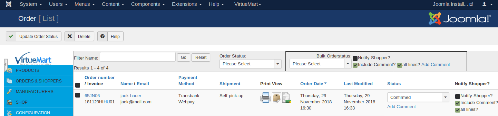

 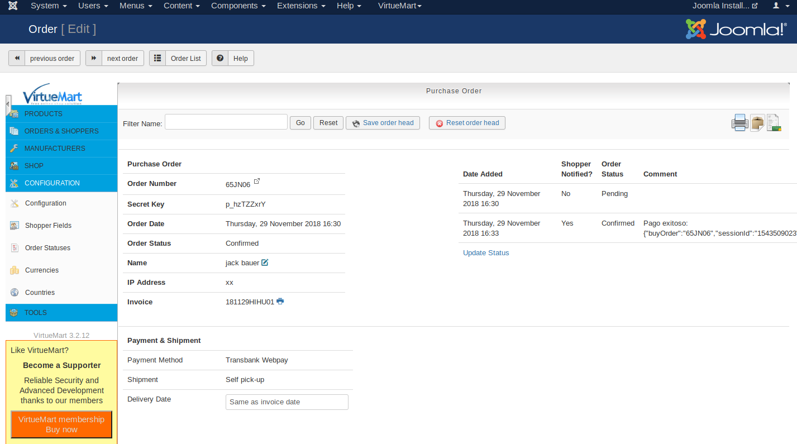
